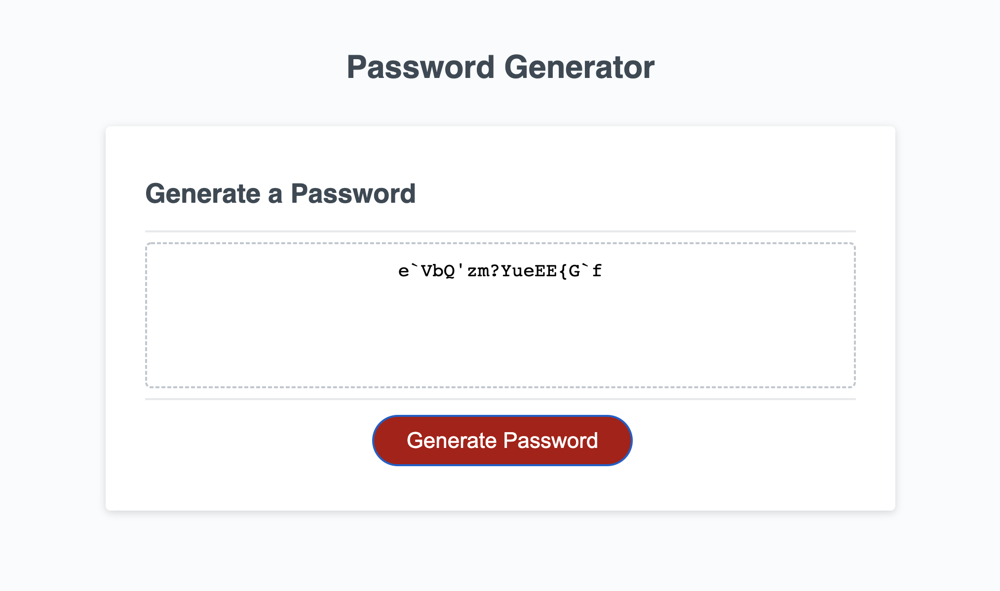

# homework3_passwordGenerator

# Description
Random password generator that displays characters based on user selections. 

# Site Preview

    

# Github Links 
- Repository: https://github.com/mxhuisken/homework_3
- Deployed: https://mxhuisken.github.io/homework_3/

# Requirements 
- When clicking on generate password button, user is prompted to select password criteria 
- Criteria includes: 
    - password length: between 8-128 characters
    - lower/uppercase letters
    - numbers 
    - special characters 
- Validate input
- When all prompts are answered, the password is generated and displays in an alert or is written on page

# Notes
